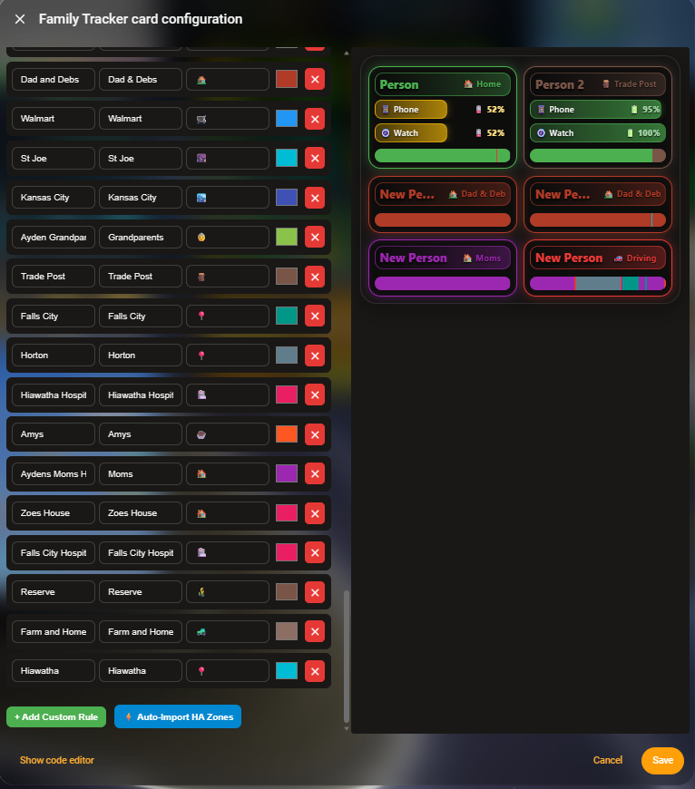
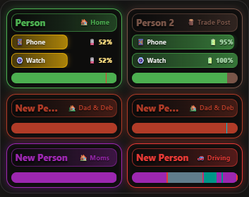
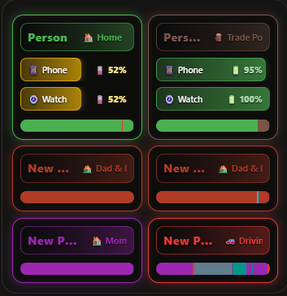
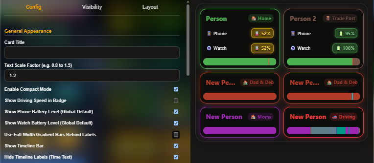

# Family Tracker Card
<p align="center">
  <a href="https://hacs.xyz/"></a>
  <a href="https://github.com/dutchsines/family-tracker-card/releases/latest"></a>
  <a href="https://github.com/dutchsines/family-tracker-card/blob/main/LICENSE"></a>
  
</p>
<p align="center">
  <a href="https://my.home-assistant.io/redirect/hacs_repository/?owner=dutchsines&repository=family-tracker-card&category=Lovelace" target="_blank" rel="noreferrer noopener">
    
  </a>
</p>

A gorgeous, highly configurable Home Assistant Lovelace custom card designed to track family presence, custom location states (with speed detection), phone/watch battery stats with charging states, and a visual history timeline bar. Fully integrated with a visual card editor and native `more-info` popups.

## Features
- **Visual Card Editor:** Easily manage cards, people, devices, and custom zone rules directly via the Home Assistant UI.
- **Location Status & History Timeline:** Real-time location badges with dynamic gradient backgrounds and a tracking history timeline bar.
- **Driving Speed Recognition:** Automatically surfaces speed in mph when traveling.
- **Battery & Charging Indicators:** Monitors phone and watch batteries with low-battery pulsing and charging animations.
- **Native Interactivity:** Click location badges or battery indicators to bring up Home Assistant's native `more-info` dialogs.
- 





## Installation (HACS)
1. Click the **"Open in HACS"** button above (or manually open HACS > Custom Repositories > Add your repo URL as category **Plugin**).
2. Click **Install**.
3. Refresh your Home Assistant frontend.

## Manual Installation
1. Download `family-tracker-card.js` from the latest release.
2. Place it in your `www` folder (e.g., `config/www/family-tracker-card.js`).
3. Add a resource reference in your dashboard or Lovelace resources:
   ```yaml
   url: /local/family-tracker-card.js
   type: module
   ```
  Example Configuration
  ```yaml
      type: custom:family-tracker-card
      title: Family Presence & Status
      hours_to_show: 8
      show_timeline: true
      hide_timeline_labels: false
      timeline_height: 12
      show_phone_battery: true
      show_watch_battery: true
      show_driving_speed: true
      use_gradient_bar: true
      compact_mode: false
      enable_blur: true
      card_border_radius: 24
      text_scale: 1.0
      people:
        - name: Dutch
          tracker: device_tracker.life360_dutch_sines
          phone_batt: sensor.dutch_pixel_10_pro_battery_level
          phone_state: sensor.dutch_pixel_10_pro_battery_state
          watch_batt: sensor.pixel_watch_3_battery_level
          watch_state: sensor.pixel_watch_3_battery_state
